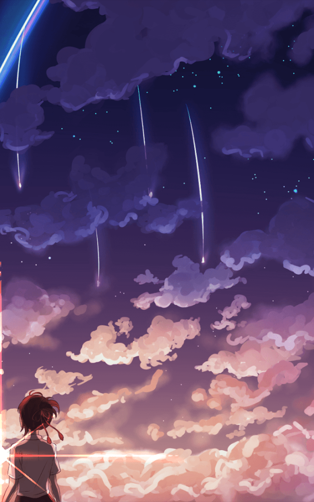

  

    
    
  

  

    <samp>
        languages: 
      <a href="https://learn.microsoft.com/en-us/dotnet/csharp/">C#</a>, 
      <a href="https://isocpp.org/">C++</a>, 
      <a href="https://www.python.org/">Python</a>, 
      <a href="https://developer.mozilla.org/en-US/docs/Web/HTML">HTML</a>
        
      discord: <a href="https://discord.com/users/327513810841763841">bigsoulja</a>
        
      support me by leaving a ⭐ on my repositories
    </samp>
  

   
  
  
  
   

